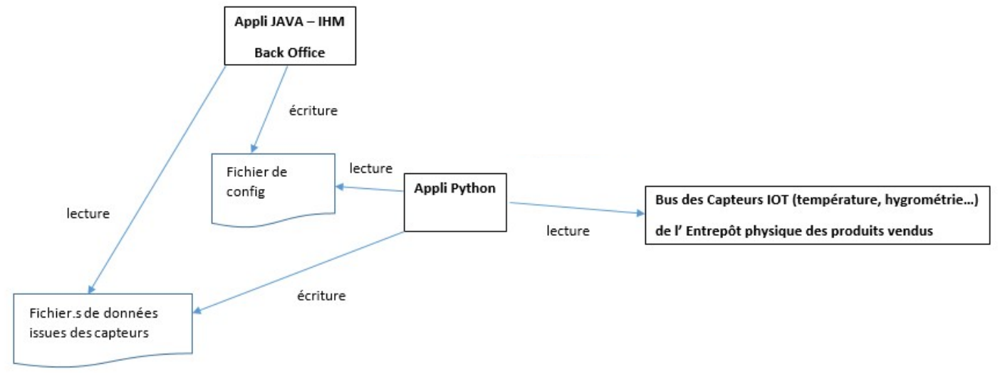
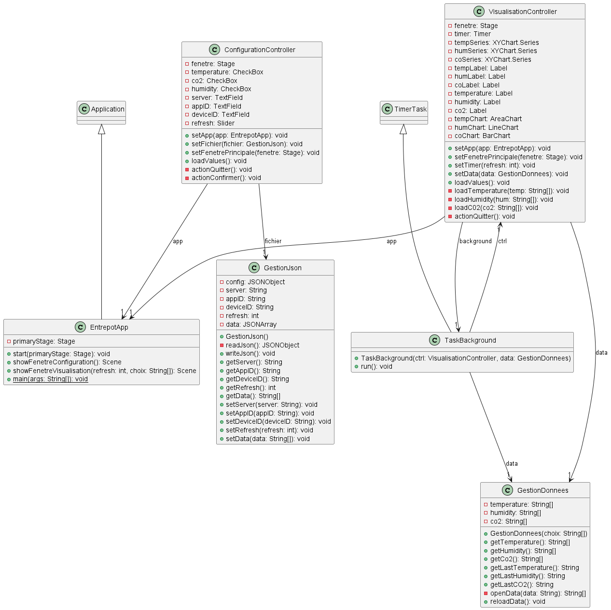
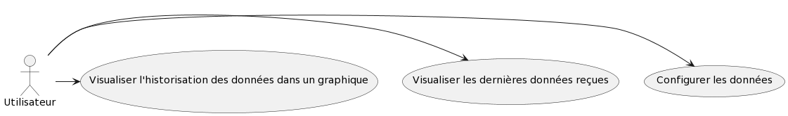

= Documentation technique application IoT
:toc:
:toc-title: Sommaire

Version de l'application : 5 +
Date : 17/01/2023 +
Equipe : 2A-8 +
Client : VidéoFest +
Projet : Gestion entrepôt +

<<<

== 1. Description du Projet
=== a) Equipe

Product Owner : Walaedine +
Scrum Master : Eva +
Développeurs : Tobiasz et Sean +

=== b) Contexte du projet

VidéoFest est une entreprise qui s'est récemment reconvertie dans la vente de périphériques en ligne, elle possède plusieurs entrepôts dont certaines données doivent être contrôlées. Il existe déjà un réseau de capteurs dans les entrepôts, qui récupèrent plusieurs informations sur les caractéristiques de l'air, comme la température, l'humidité ou la concentration en CO². L'entreprise souhaite aussi pour des raisons de sécurité avoir accès aux données de détection de présence récupérées par les capteurs. Un capteur envoit les informations au serveur toutes les 10 minutes, mais pour le moment ces données ne sont pas exploitées.

=== c) Objectifs du projet

L'objectif de ce projet est de créer une application en Java et Python, qui permettra de configurer les données que l'on veut consulter, qui se connectera au serveur et récupèrera les données voulues, et affichera ces données de façon lisible pour l'utilisateur. On aura donc une partie IHM en Java qui créera le fichier de configuration des données, puis la partie Python fera la connexion et écrira les données dans un autre fichier. Enfin, Java lira ces données et les affichera sur l'IHM.

== 2. Architecture

=== a) Architecture Générale

L’application sera déployée sur la machine du responsable de l'entrepot. L'application se divise en deux sous applications : la partie affichage des données dans l'interface, et la partie récupération des données des capteurs. +
La partie affichage des données utilise Oracle Java 1.8, JavaFX pour l’interface et la librairie org.json (disponible https://github.com/IUT-Blagnac/sae3-01-devapp-g2a-8/blob/master/ApplicationEntrepot/json-simple-1.1.1.jar[ici]) pour gérer le fichier de configuration json. La seconde partie de l'application utilise Python 3.6 minimum et le module paho-mqtt pour communiquer avec les capteurs qui sont disponibles sur un serveur. +

L'application est disponible en installant le fichier "Application.zip" dans la https://github.com/IUT-Blagnac/sae3-01-devapp-g2a-8/releases/latest[dernière release] +

=== b) Diagramme de l'architecture

Voici le diagramme correspondant à l'architecture de l'application :

L'interface Java permet de paramétrer le fichier de configuration, qui sera lu par l'application Python pour récupérer les données des capteurs. Ensuite ces données sont écrites dans des fichiers qui seront lus par Java pour afficher les données.

=== c) Ressources externes

Réferrez-vous à la https://github.com/IUT-Blagnac/sae3-01-devapp-g2a-8/blob/master/Documentation/Doc_utilisateur_iot.adoc[documentation utilisateur] pour connaître les différentes fonctionnalités du point de vue de l'utilisateur.

=== d) Structuration du code source

La structuration des packages suit le model MVC : un package view contient les vues et les controleurs correspondants. Le package model contient ce qui est lié aux données (écriture et lecture des fichiers). Et la classe principale qui lance l'application est à l'extérieur de ces packages.

Arborescence des fichiers :

* *appli.py* :
Application python
* *config.json* :
Fichier de configuration des données
* *src* :
Dossier contenant le code source
** *Launch.java* :
Classe qui lance la classe de l'application (utilisée pour faire fonctionner le jar)
** *application* : Package contenant les codes sources de l'application
*** *EntrepotApp.java* : Classe principale de l'application qui permet de charger les vues et afficher la première page
*** *view* : package contenant les vues et leur controleur
**** *Configuration.fxml* : vue de la page de configuration des données
**** *ConfigurationController.java* : controleur de la vue de configuration
**** *Visualisation.fxml* : vue de la page de visualisation des données
**** *VisualisationController.java* : controleur de la vue de visualisation
*** *model* : package contenant la gestion des données
**** *GestionJson.java* : classe qui permet la lecture et l'écriture sur le fichier de configuration `config.json`
**** *GestionDonnees.java* : classe qui permet la lecture des données reçues par l'application python et écrites dans des fichiers txt
*** *thread* : package contenant la gestion des threads
**** *TaskBackground.java* : classe qui permet de répéter la lecture des données et le rafraichissement de l'interface avec un timer

=== e) Diagramme de classe de l'application Java

La classe `EntrepotApp` est la classe principale qui permet le lancement de l'application, elle va également charger les vues et les controleurs associés : `ConfigurationController` et `VisualisationController`. + 
Les classes `GestionJson` et `GestionDonnees` ne sont pas utilisées directement, on utilise pour chacune d'elles une instance qui représente les fichiers et qui permet de faire la lecture et l'écriture. + 
La classe `TaskBackground` permet d'exécuter une tâche en boucle avec un certain Timer. + 

== 3. Fonctionnalités

Voici le Use Case général de l'application : +

=== Configurer les données

User Story n° 1 : 

En tant qu’utilisateur, je veux pouvoir configurer les informations, afin d’avoir des données précises et pertinentes. +

* Code concerné : +

** appli.py
** config.json
** EntrepotApp.java (`showFenetreConfiguration()`)
** Configuration.fxml
** ConfigurationController.java 
** GestionJson.java (instance de la classe qui est stockée par le controleur dans `this.fichier`)

Fonctionnement dans le code : +

* *Java : Lancement de la page* : +

Lorsque l'application est lancée, la fonction `showFenetreConfiguration()` est appelée dans la classe `EntrepotApp.java`, elle permet de charger la vue de la page de configuration (`Configuration.fxml`) et son controleur afin d'appeler la fonction `setFichier()` avec en argument un nouvel objet de la classe `GestionJson.java`. Et la fonction `loadValues()` qui permet de pré-remplir les champs en fonction de ce qui est présent dans le fichier `config.json`, qui a été récupéré dans l'objet de `GestionJson` lors de l'appel au constructeur. Ensuite on modifie la scene pour afficher la page. 

* *Java : Confirmation de la configuration* : +

Lorsqu'on clique sur le bouton "Confirmer", la fonction `actionConfirmer()` du controleur est appelée. Cette fonction vérifie si les champs sont remplis et si au moins un type de donnée est coché (température, humidité ou CO2). Si ce n'est pas le cas une alerte s'affiche expliquant l'erreur. Sinon on modifie les attributs de l'objet json avec les données entrées et on appelle la fonction `writeJson()` de cet objet, qui permet de modifier le fichier `config.json`.

* *Python : Lecture du fichier de configuration* : +

Après ça il faut lancer l'application python, qui va ouvrir le fichier json avec `os.open()`, récupérer son contenu à l'aide d'un buffer et formater le json en dictionnaire python.

=== Visualiser les données

User Story n° 2 :

En tant qu’utilisateur, je veux pouvoir lire les données que j’ai demandées afin de les visualiser. +

* Code concerné : +

** appli.py
** EntrepotApp.java (`showFenetreVisualisation()`)
** ConfigurationController.java
** Visualisation.fxml
** VisualisationController.java
** GestionDonnees.java (instance de la classe qui est stockée par le controleur dans `this.data`)
** TaskBackground.java (instance de la classe qui est stockée par le controleur dans `this.background`)

Fonctionnement dans le code : +

* *Python : Récupération des données* : +

La fonction `on_connect()` permet de souscrire au bus MQTT (en fonction du config.json) afin de récupérer les données qui y circulent. La fonction `on_message()` s'éxécute lorsqu'on reçoit des données des capteurs, elle récupère le flux de données en bytes au format json, et le formate en dictionnaire python. Le messag est donc stocké dans une variable globale, puis on envoie un signal d'alarme avec le taux de rafraichissement des données converti en secondes. Ensuite avec la fonction `signal` on redéfinit le comportement du programme lorsqu'il reçoit une alerte, ici on va exécuter une fonction : `handler()`. Cette fonction récupère le message précédemment stocké en variable globale, vérifie que c'est bien une nouvelle donnée, et pour chaque type de données demandées (temperature, humidité ou CO2), elle va ouvrir un fichier .txt avec `os.open()`, puis écrire la donnée dedans avec `os.write()`.

* *Java : Lancement de la page* : +

Après avoir modifié le fichier json quand on a cliqué sur "Confirmer", la fonction `actionConfirmer()` appelle `showFenetreVisualisation()` de la classe `EntrepotApp.java`, avec en paramètres le taux de rafraichissement des données (en minutes) et un tableau contenant le choix du type de données (humidité, température ou CO2). Cette méthode permet d'appeler la fonction `setData()` de la classe `VisualisationController.java` avec une nouvelle instance de la classe `GestionDonnees.java`. Ensuite la fonction `setTimer()` du controleur permet de créer une nouvelle instance de la classe `TaskBackground` et de lui attribuer un Timer. Enfin, on modifie la scene pour afficher cette page de visualisation.

* *Java : Affichage des données* : +

Le timer permet de répéter une tâche en boucle avec une période entre chaque exécution de la tâche. Ici la tâche à répéter est la récupération des données, faites avec la méthode `reloadData()` de la classe `GestionDonnees.java`, puis dès que possible on appelle la méthode `loadValues()` du controleur qui permet de rafraichir les données de l'interface. Plus précisémment dans cette fonction on met à jour les labels en appellant les fonctions `getLastTemperature()`, `getLastHumidity()` et `getLastCO2()` de l'objet `GestionDonnees`, s'ils ne sont pas vides. 

=== Visualiser l'historisation des données en graphique

User Story n° 3 :

En tant qu’utilisateur, je veux pouvoir voir les données sous forme graphique, afin d’améliorer la visualisation. +

* Code concerné : +

** Visualisation.fxml
** VisualisationController.java
** GestionDonnees.java (instance de la classe qui est stockée par le controleur dans `this.data`)

* *Python : Historisation des données* : +

Lorsqu'on écrit dans le fichier .txt avec `os.write()`, on n'efface pas les données anciennement écrites, on ajoute seulement la nouvelle donnée en séparant avec un espace blanc.

* *Java : Récupération de toutes les données* : +

Lorsqu'on créé un objet de la classe `GestionDonnees.java`, la fonction `openData()` permet de récupérer le contenu des fichier.txt, où les données sont séparées par des espaces blancs, on fait donc un appel à `split()` avec l'expression régulière de l'espace blanc (\s) afin d'avoir un tableau de données. Ces tableaux sont ensuite récupérables avec les méthodes `getTemperature()`, `getHumidity()` et `getCo2()`.

* *Java : Affichage des graphiques* : +

Dans l'interface il y a trois graphiques différents : `AreaChart` pour la température, `LineChart` pour l'humidité et `BarChart` pour le taux de CO2, et il y a pour chaque graphique une série de valeurs. Lorsque la méthode `loadValues()` est appelée par `TaskBackground`, elle appelle elle même les sous fonctions du controleur qui rafraichissent les données dans les séries de valeurs : `loadTemperature()`, `loadHumidity()`, `loadC02()`. Ces fonctions vérifient qu'il y a bien des données, puis ajoute les nouvelles données dans la série. Comme la série est liée au graphique alors l'affichage se fait automatiquement. 

=== c) Ressources externes

Réferrez-vous à la https://github.com/IUT-Blagnac/sae3-01-devapp-g2a-8/blob/master/Documentation/Doc_utilisateur_iot.adoc[documentation utilisateur] pour connaître les différentes fonctionnalités du point de vue de l'utilisateur.

=== d) Structuration du code source

Arborescence des fichiers :

* *appli.py* :
Application python
* *config.json* :
Fichier de configuration des données
* *src* :
Dossier contenant le code source
** *Launch.java* :
Classe qui lance la classe de l'application (utilisée pour faire fonctionner le jar)
** *application* : Package contenant les codes sources de l'application
*** *EntrepotApp.java* : Classe principale de l'application qui permet de charger les vues et afficher la première page
*** *view* : package contenant les vues et leur controleur
**** *Configuration.fxml* : vue de la page de configuration des données
**** *ConfigurationController.java* : controleur de la vue de configuration
**** *Visualisation.fxml* : vue de la page de visualisation des données
**** *VisualisationController.java* : controleur de la vue de visualisation
*** *model* : package contenant la gestion des données
**** *GestionJson.java* : classe qui permet la lecture et l'écriture sur le fichier de configuration `config.json`
**** *GestionDonnees.java* : classe qui permet la lecture des données reçues par l'application python et écrites dans des fichiers txt
*** *thread* : package contenant la gestion des threads
**** *TaskBackground.java* : classe qui permet de répéter la lecture des données et le rafraichissement de l'interface avec un timer

=== e) Diagramme de classe de l'application Java

== 3. Fonctionnalités

Voici le Use Case général de l'application : +

=== Configurer les données

User Story n° 1 : 

En tant qu’utilisateur, je veux pouvoir configurer les informations, afin d’avoir des données précises et pertinentes. +

* Code concerné : +

** appli.py
** config.json
** EntrepotApp.java (`showFenetreConfiguration()`)
** Configuration.fxml
** ConfigurationController.java 
** GestionJson.java (instance de la classe qui est stockée par le controleur dans `this.fichier`)

Fonctionnement dans le code : +

* *Java : Lancement de la page* : +

Lorsque l'application est lancée, la fonction `showFenetreConfiguration()` est appelée dans la classe `EntrepotApp.java`, elle permet de charger la vue de la page de configuration (`Configuration.fxml`) et son controleur afin d'appeler la fonction `setFichier()` avec en argument un nouvel objet de la classe `GestionJson.java`. Et la fonction `loadValues()` qui permet de pré-remplir les champs en fonction de ce qui est présent dans le fichier `config.json`, qui a été récupéré dans l'objet de `GestionJson` lors de l'appel au constructeur. Ensuite on modifie la scene pour afficher la page. 

* *Java : Confirmation de la configuration* : +

Lorsqu'on clique sur le bouton "Confirmer", la fonction `actionConfirmer()` du controleur est appelée. Cette fonction vérifie si les champs sont remplis et si au moins un type de donnée est coché (température, humidité ou CO2). Si ce n'est pas le cas une alerte s'affiche expliquant l'erreur. Sinon on modifie les attributs de l'objet json avec les données entrées et on appelle la fonction `writeJson()` de cet objet, qui permet de modifier le fichier `config.json`.

* *Python : Lecture du fichier de configuration* : +

Après ça il faut lancer l'application python, qui va ouvrir le fichier json avec `os.open()`, récupérer son contenu à l'aide d'un buffer et formater le json en dictionnaire python.

=== Visualiser les données

User Story n° 2 :

En tant qu’utilisateur, je veux pouvoir lire les données que j’ai demandées afin de les visualiser. +

* Code concerné : +

** appli.py
** EntrepotApp.java (`showFenetreVisualisation()`)
** ConfigurationController.java
** Visualisation.fxml
** VisualisationController.java
** GestionDonnees.java (instance de la classe qui est stockée par le controleur dans `this.data`)
** TaskBackground.java (instance de la classe qui est stockée par le controleur dans `this.background`)

Fonctionnement dans le code : +

* *Python : Récupération des données* : +

La fonction `on_connect()` permet de souscrire au bus MQTT (en fonction du config.json) afin de récupérer les données qui y circulent. La fonction `on_message()` s'éxécute lorsqu'on reçoit des données des capteurs, elle récupère le flux de données en bytes au format json, et le formate en dictionnaire python. Le messag est donc stocké dans une variable globale, puis on envoie un signal d'alarme avec le taux de rafraichissement des données converti en secondes. Ensuite avec la fonction `signal` on redéfinit le comportement du programme lorsqu'il reçoit une alerte, ici on va exécuter une fonction : `handler()`. Cette fonction récupère le message précédemment stocké en variable globale, vérifie que c'est bien une nouvelle donnée, et pour chaque type de données demandées (temperature, humidité ou CO2), elle va ouvrir un fichier .txt avec `os.open()`, puis écrire la donnée dedans avec `os.write()`.

* *Java : Lancement de la page* : +

Après avoir modifié le fichier json quand on a cliqué sur "Confirmer", la fonction `actionConfirmer()` appelle `showFenetreVisualisation()` de la classe `EntrepotApp.java`, avec en paramètres le taux de rafraichissement des données (en minutes) et un tableau contenant le choix du type de données (humidité, température ou CO2). Cette méthode permet d'appeler la fonction `setData()` de la classe `VisualisationController.java` avec une nouvelle instance de la classe `GestionDonnees.java`. Ensuite la fonction `setTimer()` du controleur permet de créer une nouvelle instance de la classe `TaskBackground` et de lui attribuer un Timer. Enfin, on modifie la scene pour afficher cette page de visualisation.

* *Java : Affichage des données* : +

Le timer permet de répéter une tâche en boucle avec une période entre chaque exécution de la tâche. Ici la tâche à répéter est la récupération des données, faites avec la méthode `reloadData()` de la classe `GestionDonnees.java`, puis dès que possible on appelle la méthode `loadValues()` du controleur qui permet de rafraichir les données de l'interface. Plus précisémment dans cette fonction on met à jour les labels en appellant les fonctions `getLastTemperature()`, `getLastHumidity()` et `getLastCO2()` de l'objet `GestionDonnees`, s'ils ne sont pas vides. 

=== Visualiser l'historisation des données en graphique

User Story n° 3 :

En tant qu’utilisateur, je veux pouvoir voir les données sous forme graphique, afin d’améliorer la visualisation. +

* Code concerné : +

** Visualisation.fxml
** VisualisationController.java
** GestionDonnees.java (instance de la classe qui est stockée par le controleur dans `this.data`)

* *Python : Historisation des données* : +

Lorsqu'on écrit dans le fichier .txt avec `os.write()`, on n'efface pas les données anciennement écrites, on ajoute seulement la nouvelle donnée en séparant avec un espace blanc.

* *Java : Récupération de toutes les données* : +

Lorsqu'on créé un objet de la classe `GestionDonnees.java`, la fonction `openData()` permet de récupérer le contenu des fichier.txt, où les données sont séparées par des espaces blancs, on fait donc un appel à `split()` avec l'expression régulière de l'espace blanc (\s) afin d'avoir un tableau de données. Ces tableaux sont ensuite récupérables avec les méthodes `getTemperature()`, `getHumidity()` et `getCo2()`.

* *Java : Affichage des graphiques* : +

Dans l'interface il y a trois graphiques différents : `AreaChart` pour la température, `LineChart` pour l'humidité et `BarChart` pour le taux de CO2, et il y a pour chaque graphique une série de valeurs. Lorsque la méthode `loadValues()` est appelée par `TaskBackground`, elle appelle elle même les sous fonctions du controleur qui rafraichissent les données dans les séries de valeurs : `loadTemperature()`, `loadHumidity()`, `loadC02()`. Ces fonctions vérifient qu'il y a bien des données, puis ajoute les nouvelles données dans la série. Comme la série est liée au graphique alors l'affichage se fait automatiquement. 

