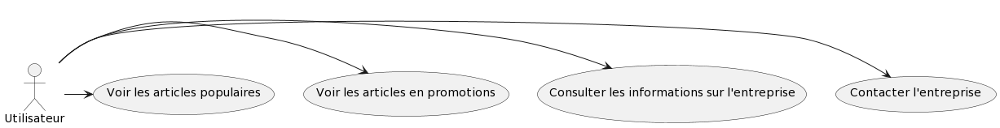
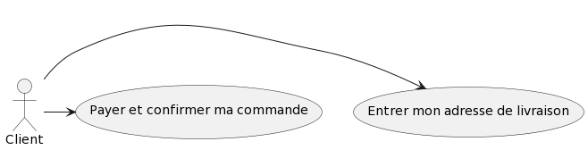

= Documentation technique site web
:toc:
:toc-title: Sommaire

Version du site : 4 +
Date : 14/01/2023 +
Client : VidéoFest +
Projet : Site de e-commerce 

<<<

== 1. Description du Projet
=== a) Equipe

Product Owner : Walaedine +
Scrum Master : Eva +
Développeurs : Tobiasz et Sean +

=== b) Contexte du projet

VideoFest est une start-up française implantée à Toulouse et créée en 2021 par les cofondateurs Vignal Alexandre, Dourlent Maxime, Fernandez Mickael et Straputicari Luca. Anciennement tournée sur des gammes d’appareils-photos, VideoFest n’a jamais connu une croissance suffisante pour se démarquer et maintenir son existence dans un domaine devenu obsolète. Aujourd’hui, les objets technologiques tels que les smartphones ou encore les tablettes implémentent cette fonctionnalité pour une qualité au point. +
L’entreprise a donc décidé de se reconvertir vers la vente de périphériques informatiques afin de répondre à une forte baisse de son chiffre d’affaires. Afin de faciliter cette vente, ils veulent avoir un nouveau site de e-commerce dédié, ce qui leur permettrait de redorer leur image, augmenter leur visibilité, et créer un avantage concurrentiel.

=== c) Objectifs du projet

L'objectif est de créer un site web en accord avec la charte graphique de l'entreprise, qui propose une gamme de périphériques variés qu'il sera possible de commander. +
VideoFest et ses produits s’adressent à tout type de clients, aussi bien pour des usages professionnels ou particuliers. Pour des clients à l’aise en technologie mais aussi des novices dans le domaine, le site devra donc être accessible et ergonomique. +

== 2. Architecture

=== a) Architecture Générale

Le site sera accessible depuis l'adresse suivante : http://193.54.227.164/~SAESYS08/ +
Le code en HTML5, CSS, PHP et JavaScript est herbergé sur un serveur, et la connexion à la base de données Oracle se fait en SQL. +

=== b) Ressources externes

Réferrez-vous à la https://github.com/IUT-Blagnac/sae3-01-devapp-g2a-8/blob/master/Documentation/Doc_utilisateur_web.adoc[documentation utilisateur] pour connaître les différentes fonctionnalités du point de vue de l'utilisateur.

=== c) Structuration du code source

Arborescence des fichiers :

* *include* +
Ce dossier contient les ressources qui seront inclues dans différentes pages du site web
** *css* +
*** *style.css* +
Feuille de style pour tout le site
** *logos* +
Ce dossier contient les images utilisées pour les icônes et le logo
** *produits* +
Ce dossier contient les images des produits
** *connect.inc.php* +
Permet d'établir la connexion à la BD
** *header.php* +
Permet l'affichage du haut de page
** *menu.php* +
Permet l'affichage du menu
** *footer.php* +
Permet l'affichage du bas de page
** *icon.php* +
Permet l'affichage d'une icône d'onglet

* *index.php* +
Page principale
* *commander.php* +
Page qui permet de commander
* *compte.php* +
Page de visualisation de compte
* *formPaiement.php* +
Formulaire de paiement
* *confirmation.php* +
Page qui permet d'ajouter la commande dans la BD après le paiement
* *deconnexion.php* +
Page de déconnexion
* *suppressionCompte.php* +
Page de suppression d'un compte client
* *entreprise.php* +
Page d'informations sur l'entreprise
* *formAdresse.php* +
Formulaire d'adresse de livraison
* *traitAdresse.php* +
Traitement du formulaire d'adresse
* *formConnexion.php* +
Formulaire de connexion
* *traitConnexion.php* +
Traitement du formulaire de connexion
* *formCreation.php* +
Formulaire de creation
* *traitCreation.php* +
Traitement du formulaire de creation
* *formCreationProduit.php* +
Formulaire de creation d'un produit
* *traitCreationProduit.php* +
Traitement du formulaire de creation de produit
* *formModificationProduit.php* +
Formulaire de modification d'un produit
* *traitModificationProduit.php* +
Traitement du formulaire de modification de produit
* *supprimerProduit.php* +
Page de suppression d'un produit dans la BD
* *formContact.php* +
Formulaire de contact
* *traitContact.php* +
Traitement du formulaire de contact
* *modificationCompte.php* +
Formulaire de modification de compte
* *traitModificationCompte.php* +
Traitement du formulaire de modification de compte
* *modificationMdp.php* +
Formulaire de modification du mot de passe
* *traitModificationMdp.php* +
Traitement du formulaire de modification du mot de passe
* *enregistrerQte.php* +
Appel à la fonction pour modifier la quantité d'un produit dans le panier
* *supprimerArticle.php* +
Appel à la fonction pour supprimer un produit dans le panier
* *gestionPanier.php* +
Page qui contient toutes les fonctions du panier
* *rechercheProduits.php* +
Page qui recherche un produit par nom ou par catégorie
* *listeProduits.php* +
Page d'affichage des produits
* *produit.php* +
Page d'affichage d'un produit

=== d) Diagramme de classe des données

Voici le diagramme de classe structurant la base de données :

image::images/DCBD.png[]

&nbsp; &nbsp; &nbsp; &nbsp; La table utilisateur sera la plus manipulée. Elle contient toutes les informations personnelles d'un utilisateur, avec son mot de passe hashé et la propriété administrateur pour indiquer si il est bien administrateur du site. +
 +
&nbsp; &nbsp; &nbsp; &nbsp; La table Article contient toutes les informations d'un article en vente et possède une catégorie qui peut avoir une catégorie parente. Un article se décline en différentes couleurs. Ces articles ont donc un stock différent pour chaque variante de couleur. +
 +
&nbsp; &nbsp; &nbsp; &nbsp; Lorsqu'un article est commandé, on enregistre la quantité voulue à l'aide de DetailCommande, et la table Commande contient le montant total et est liée à un utilisateur.

== 3. Fonctionnalités

=== a) Sprint 4 (sem 50)

Voici le Use Case général du sprint 4 : +

* Utilisateur +

image::images/utilisateur.png[]

* Client +

image::images/client.png[]

* Administrateur (rien pour le moment) +

==== Créer un compte

User Story n°5 : 

En tant qu’utilisateur, je souhaite créer un compte, afin de stocker mes informations.

Pages web concernées : +

* formConnexion.php
* formCreation.php
* traitCreation.php

Accessibilité : tout utilisateur qui n'a pas de compte +

Action de créer un compte +
Fonctionnement dans le code : +
Dans `formConnexion.php` il y a un lien "Créer un compte" qui renvoie vers le formulaire de création de compte `formCreation.php`.
Le fichier `traitCreation.php` vérifie que le formulaire a été soumis avec tous les champs remplis, il teste la validité de l'adresse mail, du nom, du prénom, il vérifie que le mot de passe respecte la norme RGPD (https://www.donneespersonnelles.fr/generateur-de-mot-de-passe[lien générateur de mot de passe]) et que la vérification du mot de passe est valide. Ensuite il se connecte à la BD et teste si l'adresse mail rentrée n'est pas déjà utilisée. Si jamais une de ces conditions n'est pas remplie, on est redirigé vers `formCreation.php` avec une erreur dans l'url, qui sera récupérée à l'aide de la variable GET et sera affichée. Si toutes les conditions sont remplies, on fait l'insert dans la BD et on redirige vers la page `index.php`.

==== Se connecter 

User Story n°6 :

En tant que client, je souhaite pouvoir me connecter, afin d’accéder à mes informations et de pouvoir commander. +

Pages web concernées : +

* formConnexion.php
* traitConnexion.php

Accessibilité : client non connecté +

Action de se connecter +
Fonctionnement dans le code : +
`formConnexion.php` affiche le formulaire pour se connecter (demande l'adresse mail et le mdp). Le fichier `traitConnexion.php` vérifie que le formulaire a été soumis avec tous les champs remplis, il se connecte à la BD est vérifie que le compte existe (avec cette adresse mail) et que le mot de passe rentré correspond bien au mdp dans la BD. Si jamais une de ces conditions n'est pas remplie, on est redirigé vers `formConnexion.php` avec une erreur dans l'url, qui sera récupérée à l'aide de la variable GET et sera affichée. Si toutes les conditions sont remplies, alors on créer la variable session avec le mode (client ou administrateur) et l'identifiant (numU dans la BD). +

==== Se déconnecter 

User Story n°7 :

En tant que client, je souhaite pouvoir me déconnecter, afin de fermer ma session. +

Pages web concernées : +

* compte.php
* deconnexion.php

Accessibilité : client connecté +

Action de se déconnecter +
Fonctionnement dans le code : +
Sur la page `compte.php`, il y a un lien "Déconnexion" qui renvoie vers la page `deconnexion.php`, cette page détruit le contenu de la variable session et redirige vers l'index. +

==== Voir ses informations

User Story n°6 :

En tant que client, je souhaite pouvoir me connecter, afin d’accéder à mes informations et de pouvoir commander. +

Pages web concernées : +

* compte.php

Accessibilité : client connecté +

Action de voir ses informations +
Fonctionnement dans le code : +
Sur la page `compte.php`, si le client est connecté, on se connecte à la BD pour récupérer les informations (select) et on les affiche.  +

==== Modifier ses informations

User Story :

En tant que client, je souhaite pouvoir modifier mes informations, afin de les mettre à jour. +

Pages web concernées : +

* compte.php
* modificationCompte.php
* traitModificationCompte.php

Accessibilité : client connecté +

Action de modifier ses informations +
Fonctionnement dans le code : +
Sur la page `compte.php`, il y a un lien "Modifier mes informations", qui renvoit vers le formulaire `modificationCompte.php`, dans lequel les champs sont préremplis. L'utilisateur peut modifier toutes les valeurs et ajouter son adresse s'il n'en avait pas d'enregistré. La page `traitModificationCompte.php` teste si le formulaire est bien soumis, si les champs nom, prénom et adresse mail sont bien remplis et valides, et si l'adresse mail n'est pas utilisée pour un autre compte.
Si jamais une de ces conditions n'est pas remplie, on est redirigé vers `modificationCompte.php` avec une erreur dans l'url, qui sera récupérée à l'aide de la variable GET et sera affichée. Si toutes les conditions sont remplies, alors se connecte à la BD et on fait l'update, puis on redirige vers `compte.php`. +

==== Modifier son mot de passe

User Story :

En tant que client, je souhaite modifier mon mot de passe, afin d'améliorer la sécurité de mon compte. +

Pages web concernées : +

* compte.php
* modificationMdp.php
* traitModificationMdp.php

Accessibilité : client connecté +

Action de modifier son mot de passe +
Fonctionnement dans le code : +
Sur la page `compte.php`, il y a un lien "Modifier mon mot de passe", qui renvoit vers le formulaire `modificationMdp.php`, dans lequel il faut rentrer l'ancier mot de passe, le nouveau, et la vérification du nouveau. La page `traitModificationMdp.php` teste si le formulaire est bien soumis, si les champs sont bien remplis, si l'ancien mot de passe correspond bien à celui dans la BD (select), si les deux champs pour le nouveau mot de passe sont égaux, et si le nouveau mot de passe respecte les normes RGPD.
Si jamais une de ces conditions n'est pas remplie, on est redirigé vers `modificationMdp.php` avec une erreur dans l'url, qui sera récupérée à l'aide de la variable GET et sera affichée. Si toutes les conditions sont remplies, alors se connecte à la BD et on fait l'update, puis on redirige vers `compte.php`. +

==== Supprimer son compte

User Story :

En tant que client, je souhaite pouvoir supprimer mon compte et enlever mes données de la base dé données, afin de pouvoir exercer mon droit d'oubli. +

Pages web concernées : +

* compte.php
* suppressionCompte.php

Accessibilité : client connecté +

Action de supprimer ses informations +
Fonctionnement dans le code : +
Sur la page `compte.php`, il y a un button "Supprimer mon compte", qui lance un pop-up Javascript de confirmation de suppression, si l'utilisateur confirme alors on redirige vers la page `suppressionCompte.php`. Cette page vérifie que l'utilisateur est connecté, il se connecte à la BD pour supprimer l'utilisateur (delete) dont l'identifiant est dans la variable SESSION, puis on détruit la session et on redirige vers la page principale avec un pop-up Javascript qui confirme la suppression.

=== b) Sprint 5 (sem 1)

Voici le Use Case général du sprint 5 : +

* Utilisateur +

image::images/utilisateur_5.png[]

* Client +

image::images/client_5.png[]

* Administrateur (rien pour le moment) +

==== Visualiser les produits par catégorie

User Story n°2 :

En tant qu’utilisateur, je cherche dans une catégorie, afin d’obtenir une liste générale de produits. +

Pages web concernées : +

* menu.php
* rechercheProduits.php
* listeProduits.php

Accessibilité : tous les utilisateurs +

Action de visualiser les produits par catégorie +
Fonctionnement dans le code : +
Dans le menu si on clique sur "Nos produits", un menu déroulant affiche les catégories de produits en vente sur le site. Chaque catégorie est un lien vers `rechercheProduits.php` avec le nom de la catégorie dans la variable GET. Cette page se connecte à la BD en fonction de la catégorie voulue, le résultat de la requête est mis dans une variable `SESSION['recherche']` puis on est redirigé vers la page `listeProduits.php` avec la catégorie recherchée dans la variable GET. La page `listeProduits.php` affiche un message s'il n'y a aucun produit, sinon elle affiche tous les produits en récupérant le résultat de la requête depuis la variable SESSION.

==== Visualiser les produits par sous-catégorie

User Story n°3 :

En tant qu’utilisateur, je cherche dans une sous-catégorie, afin d’obtenir une liste précise de produits. +

Pages web concernées : +

* header.php
* rechercheProduits.php
* listeProduits.php

Accessibilité : tous les utilisateurs +

Action de visualiser les produits par sous catégorie +
Fonctionnement dans le code : +
Si une catégorie est passée en argument par l'url (variable GET), alors le `header.php` affiche les sous catégories s'il y en a en se connectant à la BD. Chaque sous catégorie est un lien vers `rechercheProduits.php` avec le nom de la sous catégorie dans la variable GET. Cette page se connecte à la BD en fonction de la catégorie voulue, le résultat de la requête est mis dans une variable `SESSION['recherche']` puis on est redirigé vers la page `listeProduits.php` avec la catégorie recherchée dans la variable GET. La page `listeProduits.php` affiche un message s'il n'y a aucun produit, sinon elle affiche tous les produits en récupérant le résultat de la requête depuis la variable SESSION.

==== Rechercher un produit par nom

User Story :

En tant qu’utilisateur, je souhaite faire une recherche par nom de produit, afin de trouver plus facilement ce que je recherche. +

Pages web concernées : +

* header.php
* rechercheProduits.php
* listeProduits.php

Accessibilité : tous les utilisateurs +

Action de visualiser les produits par nom +
Fonctionnement dans le code : +
Lorsque l'utilisateur entre quelque chose dans la barre de recherche présente dans le `header.php`, l'entrée est envoyée dans l'url à la page `rechercheProduits.php`. Cette page se connecte à la BD en fonction du nom de produit voulu, le résultat de la requête est mis dans une variable `SESSION['recherche']` puis on est redirigé vers la page `listeProduits.php` avec le nom recherché dans la variable GET. La page `listeProduits.php` affiche un message s'il n'y a aucun produit, sinon elle affiche tous les produits en récupérant le résultat de la requête depuis la variable SESSION.

==== Visualiser un produit

User Story n°4 :

En tant qu’utilisateur, je peux sélectionner un produit, afin de voir les détails. +

Pages web concernées : +

* listeProduits.php
* produit.php

Accessibilité : tous les utilisateurs +

Action de visualiser les produits par nom +
Fonctionnement dans le code : +
Dans la page d'affichage des produits `listeProduits.php`, un lien "Voir plus" est présent en dessous de chaque produit qui renvoie vers la page `produit.php` avec l'identifiant du produit dans la variable GET. Cette page se connecte à la BD pour afficher toutes les informations du produit. +

==== Mettre un article au panier

User Story n°10 :

En tant que client, je souhaite stocker les produits que je veux acheter dans un panier. +

Pages web concernées : +

* produit.php
* gestionPanier.php
* panier.php

Accessibilité : client connecté +

Action de mettre un article au panier +
Fonctionnement dans le code : +
Dans la page d'un produit `produit.php`, un bouton "Ajouter au panier" permet de vérifier les sotcks pour la quantité et la couleur voulue, puis elle appelle la fonction `ajouterAuPanier` qui ajoute le produit dans la variable `SESSION['panier']` s'il est en stock.
Le panier est ensuite consultable à partir de la page `panier.php` qui récupère les produits de la variable session et les affiche s'il y en a, ou affiche un message explicite sinon. +

==== Modifier la quantité d'un article dans le panier

User Story :

En tant que client, je souhaite modifier la quantité d'un produit dans mon panier, afin de faciliter ma gestion de ma commande. +

Pages web concernées : +

* gestionPanier.php
* panier.php
* enregistrerQte.php

Accessibilité : client connecté +

Action de modifier la quantité voulue +
Fonctionnement dans le code : +
Dans la page 'panier.php', il est possible de modifier le champ 'Quantité' et en cliquant sur "Modifier". Ce bouton est un lien vers la page `enregistrerQte.php` qui appelle la fonction `modifierQuantite` de la page `gestionPanier.php`. Cette fonction peut renvoyer une exception s'il n'y a pas assez de stock, dans ce cas l'exception est traitée par `enregistrerQte.php` qui renvoie vers `panier.php` avec une erreur dans la variable GET, qui sera affichée. +

==== Supprimer un article dans le panier

User Story :

En tant que client, je souhaite supprimer un article de mon panier, afin d'éviter de commander un article que je ne veux pas'. +

Pages web concernées : +

* gestionPanier.php
* panier.php
* supprimerArticle.php

Accessibilité : client connecté +

Action de supprimer un article du panier +
Fonctionnement dans le code : +
Dans la page 'panier.php', une image pour supprimer renvoie vers le lien `supprimerArticle.php` qui appelle la fonction `supprimerProduit` de la page `gestionPanier.php` qui supprime le produit de la variable Session. Puis on est redirigé vers la page `panier.php` où on peut voir que le produit n'est plus présent. +

=== b) Sprint 6 (sem 2)

Voici le Use Case général du sprint 6 : +

* Utilisateur +

* Client +

* Administrateur +

image::images/administrateur.png[]

==== Contacter l'entreprise 

User Story :

En tant qu’utilisateur, je souhaite contacter l’entreprise par mail ou téléphone, afin de résoudre un problème ou poser des questions +

Pages web concernées : +

* footer.php
* formContact.php
* traitContact.php

Accessibilité : tous les utilisateurs +

Action de contacter l'entreprise +
Fonctionnement dans le code : +
Il y a un lien dans le `footer.php` qui se nomme "Nous contacter" et qui renvoie vers `formContact.php` qui affiche le formulaire de connexion. Si le formulaire est soumis, la page `traitContact.php` vérifie que tous les champs soient remplis (nom, prénom, e-mail et message) et corrects. S'il y a une erreur on est redirigé vers `formContact.php` qui affiche le message d'erreur dans l'url à l'aide de la variable GET. Sinon, un pop-up JavaScript indique que le message est envoyé et redirige vers l'index. +

==== Consulter les informations sur l'entreprise 

User Story :

En tant qu’utilisateur, je souhaite pouvoir consulter les informations sur l’entreprise. +

Pages web concernées : +

* footer.php
* entreprise.php

Accessibilité : tous les utilisateurs +

Action de voir les informations sur VidéoFest +
Fonctionnement dans le code : +
Il y a un lien dans le `footer.php` qui se nomme "Notre entreprise" et qui renvoie vers `entreprise.php`. Cette page affiche une image de l'équipe ainsi que les informations de l'entreprise. +

==== Voir les articles en promotions 

User Story :

En tant qu’utilisateur, je souhaite avoir accès aux promotions que le site propose. +

Pages web concernées : +

* menu.php
* rechercheProduits.php
* listeProduits.php

Accessibilité : tous les utilisateurs +

Action de voir uniquement les articles en promotions +
Fonctionnement dans le code : +
Dans le menu si on clique sur "Nos produits", un menu déroulant affiche les catégories de produits en vente sur le site, ainsi que la catégorie "Promotions". C'est un lien vers `rechercheProduits.php` avec comme nom de catégorie "Promotions" dans la variable GET. Cette page se connecte à la BD et récupère les produits ayant une promotion, le résultat de la requête est mis dans une variable `SESSION['recherche']` puis on est redirigé vers la page `listeProduits.php`. La page `listeProduits.php` affiche un message s'il n'y a aucun produit, sinon elle affiche tous les produits en récupérant le résultat de la requête depuis la variable SESSION.

==== Voir les articles populaires 

User Story :

En tant qu'utiliateur, je souhaite voir les produits les plus populaires (les plus vendus). +

Pages web concernées : +

* index.php
* rechercheProduits.php
* listeProduits.php

Accessibilité : tous les utilisateurs +

Action de voir les artciles les plus vendus +
Fonctionnement dans le code : +
La page principale `index.php` renvoie vers `rechercheProduits.php` avec comme nom de catégorie "Populaires" dans la variable GET. Cette page se connecte à la BD et récupère les produits les plus vendus (somme de quantités vendues supérieure à la moyenne), le résultat de la requête est mis dans une variable `SESSION['recherche']` puis on est redirigé vers la page `listeProduits.php`. La page `listeProduits.php` affiche un message s'il n'y a aucun produit, sinon elle affiche tous les produits en récupérant le résultat de la requête depuis la variable SESSION.

==== Entrer mon adresse de livraison

User Story :

En tant que client, je souhaite entrer mon adresse, afin de commander les articles de mon panier. +

Pages web concernées : +

* panier.php
* commander.php
* formAdresse.php
* traitAdresse.php

Accessibilité : client connecté  +

Action de commander les articles d'un panier +
Fonctionnement dans le code : +
Dans la page `panier.php`, s'il y a au moins un article présent, un bouton "Passer commande" permet de procéder à la commande des articles. Le bouton renvoie vers la page `commander.php` qui vérifie que le panier n'est pas vide est renvoie vers `formAdresse.php`. Cette page affiche un formulaire d'adresse pré-remplis avec les informations dans la BD, si le formulaire est soumis alors `traitAdresse.php` vérifie que tous les champs sont remplis et fait l'update dans la BD.

==== Payer et confirmer ma commande

User Story :

En tant que client, je souhaite payer ma commande, afin de la finaliser. +

Pages web concernées : +

* traitAdresse.php
* formPaiement.php
* confirmation.php

Accessibilité : client connecté  +

Action de payer et confirmer une commande +
Fonctionnement dans le code : +
Une fois l'adresse enregistrée dans la BD, `traitAdresse.php` redirige vers `formPaiement.php`. Cette page affiche le montant total de la commande et un bouton "Payer" renvoie vers `confirmation.php` qui vérifie que le paiement a été effectué (bouton submit cliqué) et fait les insertions dans la BD. Ensuite une pop-up JavaScript indique que la commande a bien été enregistrée.

==== Ajouter un nouveau produit 

User Story :

En tant qu’administrateur, je souhaite pouvoir ajouter un nouveau produit, afin de le mettre en vente.  +

Pages web concernées : +

* compte.php
* formCreationProduit.php
* traitCreationProduit.php

Accessibilité : administrateur connecté +

Action d'ajouter un nouveau produit en vente +
Fonctionnement dans le code : +
Dans la page de visualisation de compte (`compte.php`) un bouton "Ajouter un produit" renvoie vers `formCreationProduit.php`. Cette page affiche un formulaire où toutes les informations d'un produit et de son stock doivent être remplis (nom, marque, catégorie, descriptif, couleurs et stock disponible, prix, pourcentage de la promo). Si le formulaire est soumis, la page `traitCreationProduit.php` se connecte à la BD pour faire l'insertion du produit, puis l'insertion des stocks par couleur. Une pop-up JavaScript indique s'il y a eu une erreur dans l'insertion ou si le produit a bien été enregistré.

==== Modifier un produit 

User Story :

En tant qu’administrateur, je souhaite pouvoir modifier un produit, afin d’éditer ses détails ou le mettre en promo. +

Pages web concernées : +

* produit.php
* formModificationProduit.php
* traitModificationProduit.php

Accessibilité : administrateur connecté +

Action de modifier un produit existant +
Fonctionnement dans le code : +
Dans la page de visualisation d'un produit (`produit.php`), un bouton "Modifier le produit" renvoie vers `formModificationProduit.php`. Cette page affiche un formulaire pré-remplis avec toutes les informations d'un produit. Si le formulaire est soumis, la page `traitModificationProduit.php` se connecte à la BD pour faire l'update des informations du produit, et renvoie vers la page du produit en question afin de visualiser le changement effectué.

==== Supprimer un produit 

User Story :

En tant qu’administrateur, je souhaite pouvoir supprimer un produit, afin qu’il ne soit plus mis en vente. +

Pages web concernées : +

* produit.php
* supprimerProduit.php

Accessibilité : administrateur connecté +

Action de supprimer un produit existant +
Fonctionnement dans le code : +
Dans la page de visualisation d'un produit (`produit.php`), un bouton "Supprimer le produit" affiche un pop-up JavaScript qui demande la confirmation de la suppression, si on clique sur "OK" alors on est renvoyé vers `supprimerProduit.php` qui appelle ala procédure de suppression d'un produit si le produit existe, puis affiche un pop-up qui indique que la suppression a bien été enregistrée. 
