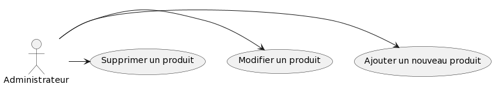

= Documentation technique site web
:toc:
:toc-title: Sommaire

Version du site : 1 +
Date : 12/12/2022 +
Client : VidéoFest +
Projet : Site de e-commerce 

<<<

== 1. Description du Projet
=== a) Equipe

Product Owner : Walaedine +
Scrum Master : Eva +
Développeurs : Tobiasz et Sean +

=== b) Contexte du projet

VideoFest est une start-up française implantée à Toulouse et créée en 2021 par les cofondateurs Vignal Alexandre, Dourlent Maxime, Fernandez Mickael et Straputicari Luca. Anciennement tournée sur des gammes d’appareils-photos, VideoFest n’a jamais connu une croissance suffisante pour se démarquer et maintenir son existence dans un domaine devenu obsolète. Aujourd’hui, les objets technologiques tels que les smartphones ou encore les tablettes implémentent cette fonctionnalité pour une qualité au point. +
L’entreprise a donc décidé de se reconvertir vers la vente de périphériques informatiques afin de répondre à une forte baisse de son chiffre d’affaires. Afin de faciliter cette vente, ils veulent avoir un nouveau site de e-commerce dédié, ce qui leur permettrait de redorer leur image, augmenter leur visibilité, et créer un avantage concurrentiel.

=== c) Objectifs du projet

L'objectif est de créer un site web en accord avec la charte graphique de l'entreprise, qui propose une gamme de périphériques variés qu'il sera possible de commander. +
VideoFest et ses produits s’adressent à tout type de clients, aussi bien pour des usages professionnels ou particuliers. Pour des clients à l’aise en technologie mais aussi des novices dans le domaine, le site devra donc être accessible et ergonomique. +

== 2. Architecture

=== a) Architecture Générale

Le site sera accessible depuis l'adresse suivante : http://193.54.227.164/~SAESYS08/ +
Le code en HTML5, CSS, PHP et JavaScript est herbergé sur un serveur, et la connexion à la base de données Oracle se fait en SQL. +

=== b) Ressources externes

Réferrez-vous à la https://github.com/IUT-Blagnac/sae3-01-devapp-g2a-8/blob/master/Documentation/Doc_utilisateur_web.adoc[documentation utilisateur] pour connaître les différentes fonctionnalités du point de vue de l'utilisateur.

=== c) Structuration du code source

Arborescence des fichiers :

* *include* +
Ce dossier contient les ressources qui seront inclues dans différentes pages du site web
** *css* +
*** *style.css* +
Feuille de style pour tout le site
** *logos* +
Ce dossier contient les images utilisées pour les icônes et le logo
** *connect.inc.php* +
Permet d'établir la connexion à la BD
** *header.php* +
Permet l'affichage du haut de page
** *menu.php* +
Permet l'affichage du menu
** *footer.php* +
Permet l'affichage du bas de page
** *icon.php* +
Permet l'affichage d'une icône d'onglet

* *index.php* +
Page principale
* *compte.php* +
Page de visualisation de compte
* *deconnexion.php* +
Page de déconnexion
* *formConnexion.php* +
Formulaire de connexion
* *traitConnexion.php* +
Traitement du formulaire de connexion
* *formCreation.php* +
Formulaire de creation
* *traitCreation.php* +
Traitement du formulaire de creation
* *formContact.php* +
Formulaire de contact
* *traitContact.php* +
Traitement du formulaire de contact
* *modificationCompte.php* +
Formulaire de modification de compte
* *traitModificationCompte.php* +
Traitement du formulaire de modification de compte
* *modificationMdp.php* +
Formulaire de modification du mot de passe
* *traitModificationMdp.php* +
Traitement du formulaire de modification du mot de passe

=== d) Diagramme de classe des données

Voici le diagramme de classe structurant la base de données :

image::images/DCBD.png[]

&nbsp; &nbsp; &nbsp; &nbsp; La table utilisateur sera la plus manipulée. Elle contient toutes les informations personnelles d'un utilisateur, avec son mot de passe hashé et la propriété administrateur pour indiquer si il est bien administrateur du site. +
 +
&nbsp; &nbsp; &nbsp; &nbsp; La table Article contient toutes les informations d'un article en vente et possède un catégorie qui peut avoir un catégorie parente. Un article se décline en différentes couleurs. Ces articles ont donc un stock différent pour chaque variante de couleur. +
 +
Lors de son ajout au 

== 3. Fonctionnalités

=== a) Sprint 2 (sem 50)

Voici le Use Case général du sprint 2 : +

* Utilisateur +

image::images/utilisateur.png[]

* Client +

image::images/client.png[]

* Administrateur (rien pour le moment) +

==== Créer un compte

User Story n°5 : 

En tant qu’utilisateur, je souhaite créer un compte, afin de stocker mes informations.

Pages web concernées : +

* formConnexion.php
* formCreation.php
* traitCreation.php

Accessibilité : tout utilisateur qui n'a pas de compte +

Action de créer un compte +
Fonctionnement dans le code : +
Dans `formConnexion.php` il y a un lien "Créer un compte" qui renvoie vers le formulaire de création de compte `formCreation.php`.
Le fichier `traitCreation.php` vérifie que le formulaire a été soumis avec tous les champs remplis, il teste la validité de l'adresse mail, du nom, du prénom, il vérifie que le mot de passe respecte la norme RGPD (https://www.donneespersonnelles.fr/generateur-de-mot-de-passe[lien générateur de mot de passe]) et que la vérification du mot de passe est valide. Ensuite il se connecte à la BD et teste si l'adresse mail rentrée n'est pas déjà utilisée. Si jamais une de ces conditions n'est pas remplie, on est redirigé vers `formCreation.php` avec une erreur dans l'url, qui sera récupérée à l'aide de la variable GET et sera affichée. Si toutes les conditions sont remplies, on fait l'insert dans la BD et on redirige vers la page `index.php`.

==== Se connecter 

User Story n°6 :

En tant que client, je souhaite pouvoir me connecter, afin d’accéder à mes informations et de pouvoir commander. +

Pages web concernées : +

* formConnexion.php
* traitConnexion.php

Accessibilité : client non connecté +

Action de se connecter +
Fonctionnement dans le code : +
`formConnexion.php` affiche le formulaire pour se connecter (demande l'adresse mail et le mdp). Le fichier `traitConnexion.php` vérifie que le formulaire a été soumis avec tous les champs remplis, il se connecte à la BD est vérifie que le compte existe (avec cette adresse mail) et que le mot de passe rentré correspond bien au mdp dans la BD. Si jamais une de ces conditions n'est pas remplie, on est redirigé vers `formConnexion.php` avec une erreur dans l'url, qui sera récupérée à l'aide de la variable GET et sera affichée. Si toutes les conditions sont remplies, alors on créer la variable session avec le mode (client ou administrateur) et l'identifiant (numU dans la BD). +

==== Se déconnecter 

User Story n°7 :

En tant que client, je souhaite pouvoir me déconnecter, afin de fermer ma session. +

Pages web concernées : +

* compte.php
* deconnexion.php

Accessibilité : client connecté +

Action de se déconnecter +
Fonctionnement dans le code : +
Sur la page `compte.php`, il y a un lien "Déconnexion" qui renvoie vers la page `deconnexion.php`, cette page détruit le contenu de la variable session et redirige vers l'index. +

==== Voir ses informations

User Story n°8 :

En tant que client, je souhaite pouvoir me connecter, afin d’accéder à mes informations et de pouvoir commander. +

Pages web concernées : +

* compte.php

Accessibilité : client connecté +

Action de voir ses informations +
Fonctionnement dans le code : +
Sur la page `compte.php`, si le client est connecté, on se connecte à la BD pour récupérer les informations (select) et on les affiche.  +

==== Modifier ses informations

User Story n°9:

En tant que client, je souhaite pouvoir modifier mes informations, afin de les mettre à jour. +

Pages web concernées : +

* modificationCompte.php
* traitModificationCompte.php

Accessibilité : client connecté +

Action de modifier ses informations +
Fonctionnement dans le code : +
Sur la page `compte.php`, il y a un lien "Modifier mes informations", qui renvoit vers le formulaire `modificationCompte.php`, dans lequel les champs sont préremplis (A FINIR)

==== Modifier son mot de passe

User Story n°10 :

En tant que client, je souhaite modifier mon mot de passe, afin de mieux améliorer la sécurité de mon compte. +

Pages web concernées : +

* modificationMdp.php
* traitModificationMdp.php

Accessibilité : client connecté +

Action de modifier son mot de passe +
Fonctionnement dans : +
Sur la page `compte.php`, il y a un lien "Modifier mon mot de passe", qui renvoi vers le formulaire `modificationMdp.php`, dans lequel l'utilisateur renseigne l'ancien mot de passe, puis le nouveau, on retape le nouveau mot de passe et on valide. Le fichier `traitModificationMdp.php` va ensuite vérifier, que tout les champs soumis sont remplis, il se connecte à la BD est vérifie que l'ancien mot de passe correspond au compte liée a cette session. Si jamais une de ces conditions n'est pas remplie, on est redirigé vers `modificationMdp.php` avec une erreur dans l'url, qui sera récupérée à l'aide de la variable GET et sera affichée. Si toutes les conditions sont remplies, alors on remplace l'ancien mot de passe par le nouveau et l'utilisateur reste connecté. +

==== Supprimer son compte

User Story n°X:

En tant que client, je souhaite pouvoir supprimer mon compte et enlever mes données de la base dé données. +

Pages web concernées : +

* compte.php
* suppressionCompte.php

Accessibilité : client connecté +

Action de supprimer ses informations +
Fonctionnement dans le code : +
Sur la page `compte.php`, il y a un button "Supprimer mon compte", qui déclenche la fonction `suppressionCompte.php`. Cette fonction renvoie une alerte. Si on appuie sur cancel, on revient sur la page avec aucun changement. Si on appuie sur OK, le site se connecte a la BD, fait une suppression de la base de données, puis nous retourne a la page d’accueil avec un popup 'Suppression effectuée'

=== b) Sprint 3 (sem 1)
