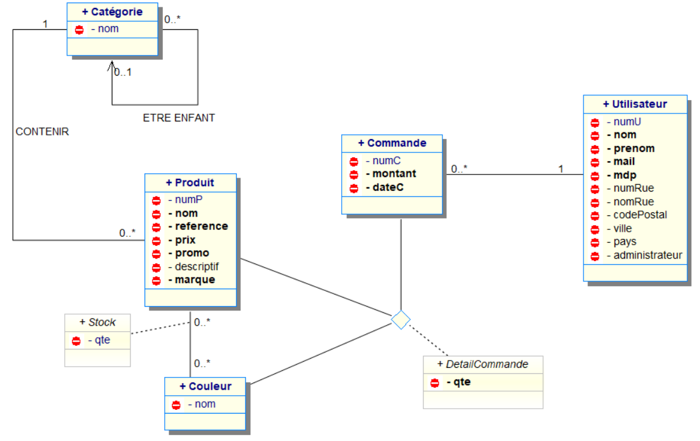

= Documentation technique site web
:toc:
:toc-title: Sommaire

Version du site : 1 +
Date : 12/12/2022 +
Client : VidéoFest +
Projet : Site de e-commerce 

<<<

== 1. Description du Projet
=== a) Equipe

Product Owner : Walaedine +
Scrum Master : Eva +
Développeurs : Tobiasz et Sean +

=== b) Contexte du projet

VideoFest est une start-up française implantée à Toulouse et créée en 2021 par les cofondateurs Vignal Alexandre, Dourlent Maxime, Fernandez Mickael et Straputicari Luca. Anciennement tournée sur des gammes d’appareils-photos, VideoFest n’a jamais connu une croissance suffisante pour se démarquer et maintenir son existence dans un domaine devenu obsolète. Aujourd’hui, les objets technologiques tels que les smartphones ou encore les tablettes implémentent cette fonctionnalité pour une qualité au point. +
L’entreprise a donc décidé de se reconvertir vers la vente de périphériques informatiques afin de répondre à une forte baisse de son chiffre d’affaires. Afin de faciliter cette vente, ils veulent avoir un nouveau site de e-commerce dédié, ce qui leur permettrait de redorer leur image, augmenter leur visibilité, et créer un avantage concurrentiel.

=== c) Objectifs du projet

L'objectif est de créer un site web en accord avec la charte graphique de l'entreprise, qui propose une gamme de périphériques variés qu'il sera possible de commander. +
VideoFest et ses produits s’adressent à tout type de clients, aussi bien pour des usages professionnels ou particuliers. Pour des clients à l’aise en technologie mais aussi des novices dans le domaine, le site devra donc être accessible et ergonomique. +

== 2. Architecture

=== a) Architecture Générale

Le site sera accessible depuis l'adresse suivante : http://193.54.227.164/~SAESYS08/ +
Le code en HTML5, CSS, PHP et JavaScript est herbergé sur un serveur, et la connexion à la base de données Oracle se fait en SQL. +

=== b) Ressources externes

Réferrez-vous à la https://github.com/IUT-Blagnac/sae3-01-devapp-g2a-8/blob/master/Documentation/Doc_utilisateur_web.adoc[documentation utilisateur] pour connaître les différentes fonctionnalités du point de vue de l'utilisateur.

=== c) Structuration du code source

Arborescence des fichiers :

* *include* +
Ce dossier contient les ressources qui seront inclues dans différentes pages du site web
** *css* +
*** *style.css* +
Feuille de style pour tout le site
** *logos* +
Ce dossier contient les images utilisées pour les icônes et le logo
** *connect.inc.php* +
Permet d'établir la connexion à la BD
** *header.php* +
Permet l'affichage du haut de page
** *menu.php* +
Permet l'affichage du menu
** *footer.php* +
Permet l'affichage du bas de page
** *icon.php* +
Permet l'affichage d'une icône d'onglet

* *index.php* +
Page principale
* *compte.php* +
Page de visualisation de compte
* *deconnexion.php* +
Page de déconnexion
* *formConnexion.php* +
Formulaire de connexion
* *traitConnexion.php* +
Traitement du formulaire de connexion
* *formCreation.php* +
Formulaire de creation
* *traitCreation.php* +
Traitement du formulaire de creation
* *formContact.php* +
Formulaire de contact
* *traitContact.php* +
Traitement du formulaire de contact
* *modificationCompte.php* +
Formulaire de modification de compte
* *traitModificationCompte.php* +
Traitement du formulaire de modification de compte
* *modificationMdp.php* +
Formulaire de modification du mot de passe
* *traitModificationMdp.php* +
Traitement du formulaire de modification du mot de passe

=== d) Diagramme de classe des données

Voici le diagramme de classe structurant la base de données :

== 3. Fonctionnalités

=== a) Sprint 2 (sem 50)

Voici le Use Case général du sprint 2 :

image:[]

==== (nom de la fonctionalité)

Use case : 

image:[]

Pages web concernées :

* include :  
** css +
*** style.css

* index.php

Accessibilité : (utilisateur lambda ou client ou admin) +

Action de (...) +
Fonctionnement dans le code : (...) +

=== b) Sprint 3 (sem 1)
