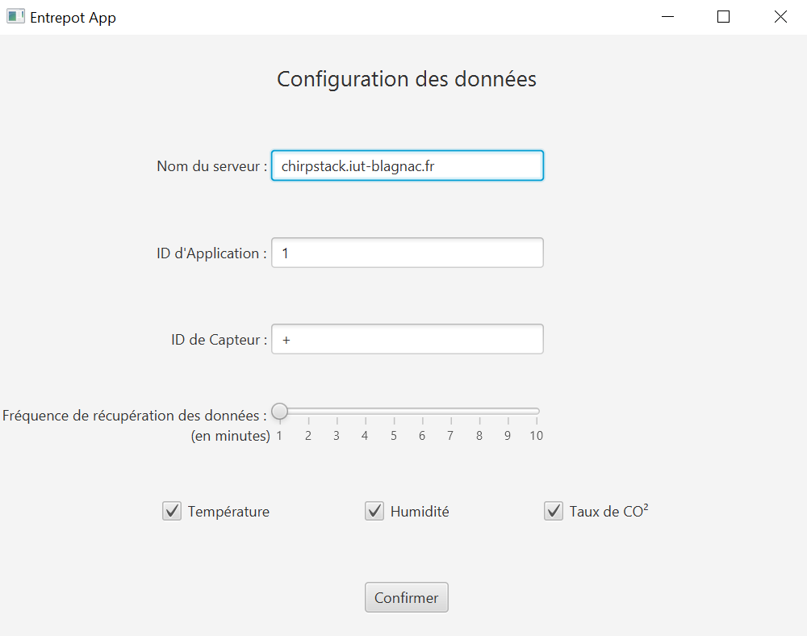
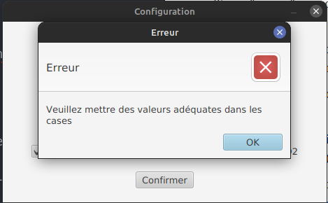

= Documentation utilisateur application IoT
:toc:
:toc-title: Sommaire

Version de l'application : 3 +
Date : 08/01/2023 +
Equipe : 2A-8 +
Client : VidéoFest +
Projet : Gestion entrepôt + 

<<<

== 1. Description du Projet
=== a) Equipe

Product Owner : Walaedine +
Scrum Master : Eva +
Développeurs : Tobiasz et Sean +

=== b) Contexte du projet

VidéoFest est une entreprise qui s'est récemment reconvertie dans la vente de périphériques en ligne, elle possède plusieurs entrepôts dont certaines données doivent être contrôlées. Il existe déjà un réseau de capteurs dans les entrepôts, qui récupèrent plusieurs informations sur les caractéristiques de l'air, comme la température, l'humidité ou la concentration en CO². L'entreprise souhaite aussi pour des raisons de sécurité avoir accès aux données de détection de présence récupérées par les capteurs. Un capteur envoit les informations au serveur toutes les 10 minutes, mais pour le moment ces données ne sont pas exploitées.

=== c) Objectifs du projet

L'objectif de ce projet est de créer une application en Java et Python, qui permettra de configurer les données que l'on veut consulter, qui se connectera au serveur et récupèrera les données voulues, et affichera ces données de façon lisible pour l'utilisateur. On aura donc une partie IHM en Java qui créera le fichier de configuration des données, puis la partie Python fera la connexion et écrira les données dans un autre fichier. Enfin, Java lira ces données et les affichera sur l'IHM.

== 2. Installer l'application
=== a) Prérequis
* Système d'exploitation Debian/Ubuntu
* L'utilisateur qui effectue l'installation doit être sudoer
* Installer les applications dans un répertoire dans lequel on a les droits de créer des nouveaux fichiers

=== b) Installation
Ouvrir un terminal et exécuter les commandes suivantes afin d'installer Python : +
`sudo apt update` +
`sudo apt install python3` +
Garder le terminal ouvert pour installer Java 17 : +
`sudo apt install openjdk-17-jdk openjdk-17-jre` +

L'application python utilise le module paho-mqtt pour communiquer avec les capteurs, il faut donc l'installer avec : +
`pip install paho-mqtt` +

Pour récupérer l'application, naviguez vers la dernière release (ou cliquez https://github.com/IUT-Blagnac/sae3-01-devapp-g2a-8/releases/latest[ici]), et téléchargez le fichier .jar et le fichier .py . +
Placer ces deux fichiers dans le même répertoire. +

== 3. Utiliser l'application

=== a) Fenêtre Configuration
Ouvrir un terminal et se placer dans le même répertoire que l'aplication java avec la commande `cd <chemin du répertoire>`. Lancer l'application Java avec la commande `java -jar [nom_du_jar].jar`. +

L'application recherche un fichier contenant des données. Si jamais celui n'existe pas, il en créera un dans le même répertoire que l'application. +
Le fichier de configuartion est composé de: +

 * un String "server" qui correspond a l'adresse de serveur sur lequel on veut se connecter (Par défaut: chirpstack.iut-blagnac.fr). +

 * un Array de Strings "data" qui correspond aux données que on veut afficher (Par défaut: ["temperature","humidity","co2"]). +

 * un String "appID" qui correspond a l'identifiant de l'application (Par défaut: 1).

 * un String "deviceID" qui correspond au capteur au quel on veut se connecter (Par défaut: +).

 * un Long "refresh" qui correspond au a la fréquence de rafraîchissement des données dans notre application (Par défaut: 1).

Lorsque les données sont charges, on permet a l'utilisateur de les modifier, avant de confirmer son choix. La seule contrainte pour les données est que le refresh doit être un chiffre, et aucune des casses peut être nulle. +

Si une des contraintes n'est pas respecté alors le programme affiche une popup "erreur", et ne sauvegarde pas les données tant que ils ne sont pas modifié pour respecter les contrainte

Si tout est bon, l'utilisateur peut cliquer sur le button 'CONFIRMER' qui sauvegarde les nouveaux données dans le fichier.

