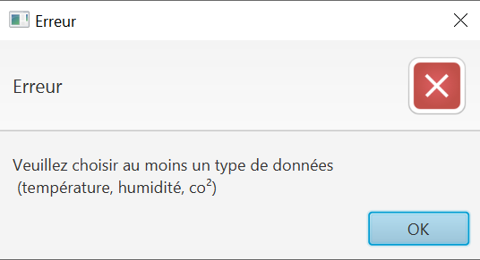

= Documentation utilisateur application IoT
:toc:
:toc-title: Sommaire

Version de l'application : 5 +
Date : 12/01/2023 +
Equipe : 2A-8 +
Client : VidéoFest +
Projet : Gestion entrepôt + 

<<<

== 1. Description du Projet
=== a) Equipe

Product Owner : Walaedine +
Scrum Master : Eva +
Développeurs : Tobiasz et Sean +

=== b) Contexte du projet

VidéoFest est une entreprise qui s'est récemment reconvertie dans la vente de périphériques en ligne, elle possède plusieurs entrepôts dont certaines données doivent être contrôlées. Il existe déjà un réseau de capteurs dans les entrepôts, qui récupèrent plusieurs informations sur les caractéristiques de l'air, comme la température, l'humidité ou la concentration en CO². L'entreprise souhaite aussi pour des raisons de sécurité avoir accès aux données de détection de présence récupérées par les capteurs. Un capteur envoit les informations au serveur toutes les 10 minutes, mais pour le moment ces données ne sont pas exploitées.

=== c) Objectifs du projet

L'objectif de ce projet est de créer une application en Java et Python, qui permettra de configurer les données que l'on veut consulter, qui se connectera au serveur et récupèrera les données voulues, et affichera ces données de façon lisible pour l'utilisateur. On aura donc une partie IHM en Java qui créera le fichier de configuration des données, puis la partie Python fera la connexion et écrira les données dans un autre fichier. Enfin, Java lira ces données et les affichera sur l'IHM.

== 2. Installer l'application
=== a) Prérequis
* Système d'exploitation Debian/Ubuntu
* L'utilisateur qui effectue l'installation doit être sudoer
* Installer les applications dans un répertoire dans lequel on a les droits de créer des nouveaux fichiers
* Avoir installé et mis par défaut Java Oracle 1.8 : https://docs.datastax.com/en/jdk-install/doc/jdk-install/installOracleJdkDeb.html[Tutoriel]

=== b) Installation
Ouvrir un terminal et exécuter les commandes suivantes afin d'installer Python3.6 : +
`sudo apt update` +
`sudo apt install python3.6` +

Ou vous pouvez installer une version plus récente avec la commande, mais attention pour que l'application fonctionne la version ne peut pas être antérieure à 3.6 : +
`sudo apt install python3.X`

L'application python utilise le module paho-mqtt pour communiquer avec les capteurs, il faut donc l'installer avec : +
`pip install paho-mqtt` +

Pour récupérer l'application, naviguez vers la dernière release (ou cliquez https://github.com/IUT-Blagnac/sae3-01-devapp-g2a-8/releases/latest[ici]), téléchargez le fichier Application.zip et dézipper-le. +

Ensuite, ouvrez un terminal dans ce répertoire et lancez la commande suivante : +
`java -jar ApplicationEntrepot.jar` +
Cette commande va lancer l'application Java, l'application python devra être lancée plus tard. +

== 3. Utiliser l'application

=== a) Configuration

Avant de récupérer les données, il faut configurer plusieurs choses sur l'interface afin de définir les capteurs et le type de données concernés. En lançant l'application une interface de configuration va donc s'afficher : +

 * le champ *serveur* correspond à l'adresse du serveur sur lequel on veut se connecter (Par défaut: chirpstack.iut-blagnac.fr). +

 * le champ *application* correspond à l'identifiant de l'application sur laquelle se trouve les capteurs (Par défaut: 1)
 
 * le champ *capteur* correspond à l'identifiant du capteur dont on veut récupérer les données, si on veut tous les capteurs de l'application il faut mettre + (Par défaut : + )
 
 * le *taux de rafraichissement* en minutes correspond au temps qu'il se découlera au minimum entre chaque affichage de nouvelles données
 
 * le *type de données* correspond aux données que vous souhaitez récupérer, vous devez en choisir au moins une parmis température, humidité ou CO2 
 
Aucun champ ne doit être vide et au moins un type de données doit être sélectionné pour passer à la suite, sinon une alerte vous affichera une erreur :  +

Si tout est valide, l'utilisateur peut cliquer sur le button "Confirmer" qui sauvegarde les configurations et affiche la seconde page.

=== b) Visualisation

Arrivé à ce stade, il faut lancer l'autre partie de l'application qui va se connecter aux capteurs et récupérer les données. Pour cela il faut donc ouvrir un nouveau terminal dans le répertoire dézippé et lancer la commande suivante : + 
`python3.6 appli.py` +
ou `python3.X appli.py` si une version plus récente est utilisée.

Ensuite les données apparaitront au fur et à mesure (selon le taux de rafraichissement précédemment saisi) dans cette page : 

Comme indiqué, il est possible de visualiser à la fois la dernière valeur obtenue, ainsi que l'historisation des valeurs à l'aide des graphiques.
