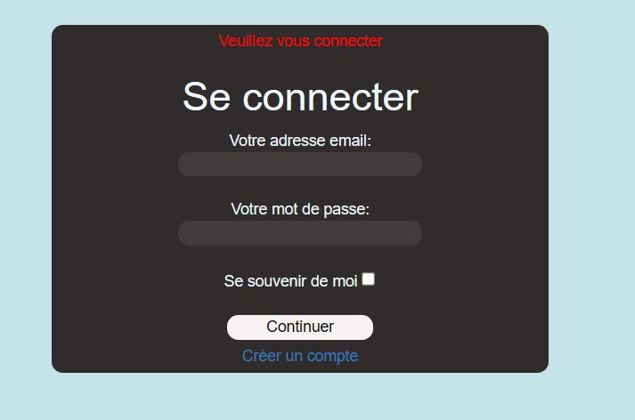

= Documentation utilisateur site web
:toc:
:toc-title: Sommaire

Version du site : 1 +
Date : 12/12/2022 +
Equipe : 2A-8 +
Client : VidéoFest +
Projet : Site web e-commerce + 

<<<

== 1. Description du Projet
=== a) Equipe

Product Owner : Walaedine +
Scrum Master : Eva +
Développeurs : Tobiasz et Sean +

=== b) Contexte du projet

VideoFest est une start-up française implantée à Toulouse et créée en 2021 par les cofondateurs Vignal Alexandre, Dourlent Maxime, Fernandez Mickael et Straputicari Luca. Anciennement tournée sur des gammes d’appareils-photos, VideoFest n’a jamais connu une croissance suffisante pour se démarquer et maintenir son existence dans un domaine devenu obsolète. Aujourd’hui, les objets technologiques tels que les smartphones ou encore les tablettes implémentent cette fonctionnalité pour une qualité au point. +
L’entreprise a donc décidé de se reconvertir vers la vente de périphériques informatiques afin de répondre à une forte baisse de son chiffre d’affaires. Afin de faciliter cette vente, ils veulent avoir un nouveau site de e-commerce dédié, ce qui leur permettrait de redorer leur image, augmenter leur visibilité, et créer un avantage concurrentiel.

=== c) Objectifs du projet

L'objectif est de créer un site web en accord avec la charte graphique de l'entreprise, qui propose une gamme de périphériques variés qu'il sera possible de commander. +
VideoFest et ses produits s’adressent à tout type de clients, aussi bien pour des usages professionnels ou particuliers. Pour des clients à l’aise en technologie mais aussi des novices dans le domaine, le site devra donc être accessible et ergonomique. +

== 2. Consulter le site web
=== a) Prérequis

Il est nécessaire d'avoir une connexion internet et un navigateur qui permet d'aller sur un site en http (pas en https) pour accéder au site.
Afin d'accéder à son compte il faut en avoir déjà créé un, sinon il sera possible d'en créer un sur le site.

=== b) Aller sur le site

Cliquez sur http://193.54.227.164/~SAESYS08/[ce lien] pour accéder au site web de VidéoFest.

== 3. Utiliser le site web

=== a) Explications des rôles

Il y a 3 rôles différents pour les utilisateurs du site : +

* l'*utilisateur sans compte*, ou qui n'est pas encore connecté : il peut visualiser les produits, contacter l'entreprise et voir les informations de l'entreprise +
* le *client connecté* : il faire tout ce qu'un utilisateur non connecté fait et en plus visualiser ses informations, les modifier, se déconnecter, supprimer le compte, créer un panier, le visualiser, commander et payer +
* l'*administrateur connecté* : il peut modifier un produit existant, le supprimer et en créer un nouveau +

=== b) Utilisateur non connecté

==== Contacter l'entreprise

(expliquer comment faire + screen)
image:[]

=== c) Client

==== Se connecter
Afin de se connecter a son compte, il faut accéder au formulaire de connexion en cliquant sur l'icone compte de la page d'accueil en haut à droite ou en cliquant sur le menu et en sélèctionnant
Afin de se connecter a son compte, il faut remplir les champs mail et mot de passe puis validé avec continuer, vous avez la possibilité d'enregistrer les champs renseigné en cochant " se soouvenir de moi":

=== d) Administrateur

==== Modifier un produit

(expliquer comment faire + screen)
image:[]
