= Documentation utilisateur site web
:toc:
:toc-title: Sommaire

Version du site : 3 +
Date : 07/01/2023 +
Equipe : 2A-8 +
Client : VidéoFest +
Projet : Site web e-commerce + 

<<<

== 1. Description du Projet
=== a) Equipe

Product Owner : Walaedine +
Scrum Master : Eva +
Développeurs : Tobiasz et Sean +

=== b) Contexte du projet

VideoFest est une start-up française implantée à Toulouse et créée en 2021 par les cofondateurs Vignal Alexandre, Dourlent Maxime, Fernandez Mickael et Straputicari Luca. Anciennement tournée sur des gammes d’appareils-photos, VideoFest n’a jamais connu une croissance suffisante pour se démarquer et maintenir son existence dans un domaine devenu obsolète. Aujourd’hui, les objets technologiques tels que les smartphones ou encore les tablettes implémentent cette fonctionnalité pour une qualité au point. +
L’entreprise a donc décidé de se reconvertir vers la vente de périphériques informatiques afin de répondre à une forte baisse de son chiffre d’affaires. Afin de faciliter cette vente, ils veulent avoir un nouveau site de e-commerce dédié, ce qui leur permettrait de redorer leur image, augmenter leur visibilité, et créer un avantage concurrentiel.

=== c) Objectifs du projet

L'objectif est de créer un site web en accord avec la charte graphique de l'entreprise, qui propose une gamme de périphériques variés qu'il sera possible de commander. +
VideoFest et ses produits s’adressent à tout type de clients, aussi bien pour des usages professionnels ou particuliers. Pour des clients à l’aise en technologie mais aussi des novices dans le domaine, le site devra donc être accessible et ergonomique. +

== 2. Consulter le site web
=== a) Prérequis

Il est nécessaire d'avoir une connexion internet et un navigateur qui permet d'aller sur un site en http (pas en https) pour accéder au site.
Afin d'accéder à son compte il faut en avoir déjà créé un, sinon il sera possible d'en créer un sur le site.

=== b) Aller sur le site

Cliquez sur http://193.54.227.164/~SAESYS08/[ce lien] pour accéder au site web de VidéoFest.

== 3. Utiliser le site web

=== a) Explications des rôles

Il y a 3 rôles différents pour les utilisateurs du site : +

* l'*utilisateur sans compte*, ou qui n'est pas encore connecté : il peut visualiser les produits, contacter l'entreprise et voir les informations de l'entreprise +
* le *client connecté* : il faire tout ce qu'un utilisateur non connecté fait et en plus visualiser ses informations, les modifier, se déconnecter, supprimer le compte, créer un panier, le visualiser, commander et payer +
* l'*administrateur connecté* : il peut modifier un produit existant, le supprimer et en créer un nouveau +

=== b) Utilisateur non connecté

==== Créer un compte 

Pour créer un compte, il faut d'abord tenter de se connecter, soit par l'icone en haut à gauche du site :

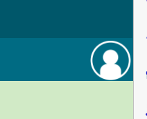

Soit par le menu :

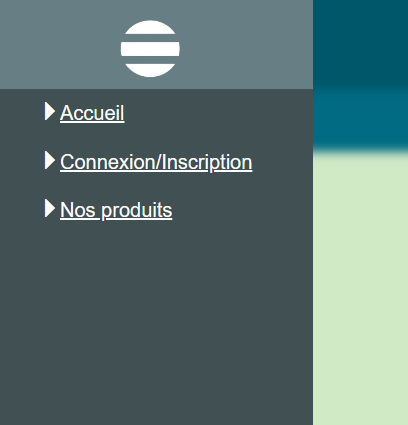

Ensuite sur la page de connexion, il faut cliquer sur "Créer un compte " :

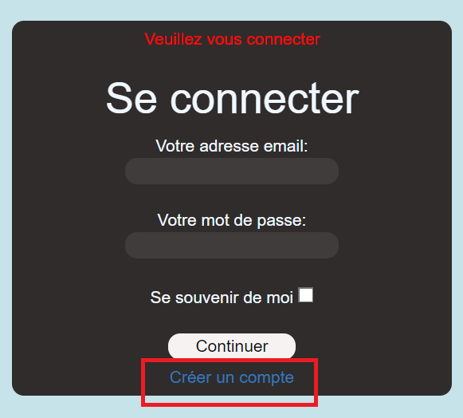

Ce qui nous amène au formulaire de création de compte : 

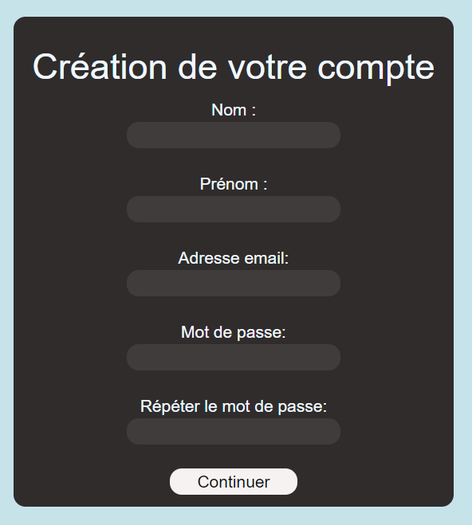

Tous les champs doivent être remplis, le nom et le prénom ne peuvent pas contenir de chiffres ou de caractères spéciaux, l'adresse mail doit avoir un format valide, le mot de passe doit respecter les normes RGPD (https://www.donneespersonnelles.fr/generateur-de-mot-de-passe[voici un générateur de mot de passe aux normes]), et la vérification du mot de passe doit être égale au mot de passe voulu. Ensuite il faut cliquer sur "Continuer" et si jamais une erreur est faite, un message explicatif s'affichera. S'il n'y a pas d'erreur le compte sera créé et on sera redirigé vers la page principale du site.

==== Visualiser les produits par catégorie

Pour choisir la catégorie de produits il faut ouvrir le menu :

Puis cliquer sur "Nos produits" pour que les différentes catégories s'affichent

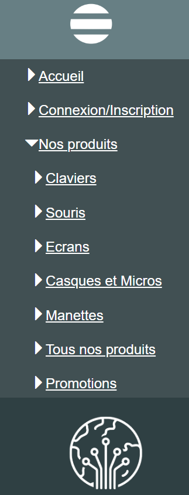

Ensuite il faut cliquer sur la catégorie voulue pour arriver sur cette page d'affichage des produits :  

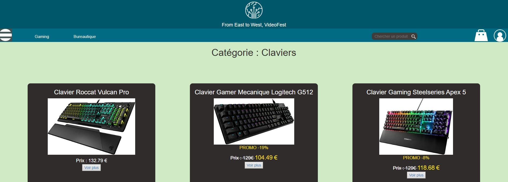

==== Visualiser les produits par sous-catégorie

Pour choisir la sous-catégorie de produits il faut d'abord avoir choisis une catégorie parente, puis cliquer sur la sous catégorie voulue : 

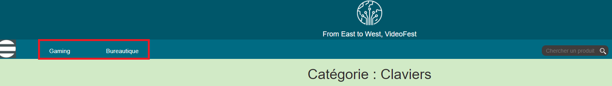

Ensuite, les produits s'affichent :  

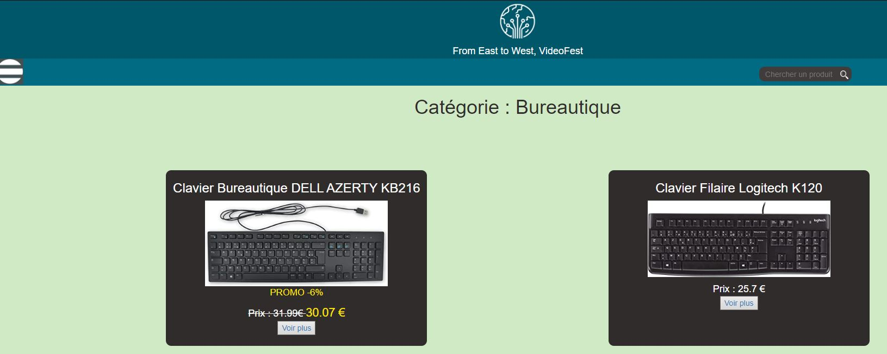

==== Rechercher un produit par nom

Pour chercher un produit par son nom ou sa marque il faut taper la recherche dans la barre de recherche : 

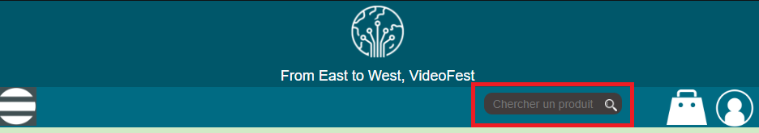

Ensuite il faut cliquer sur la touche "Entrée" ou sur l'icone de loupe afin d'afficher les produits correspondants : 

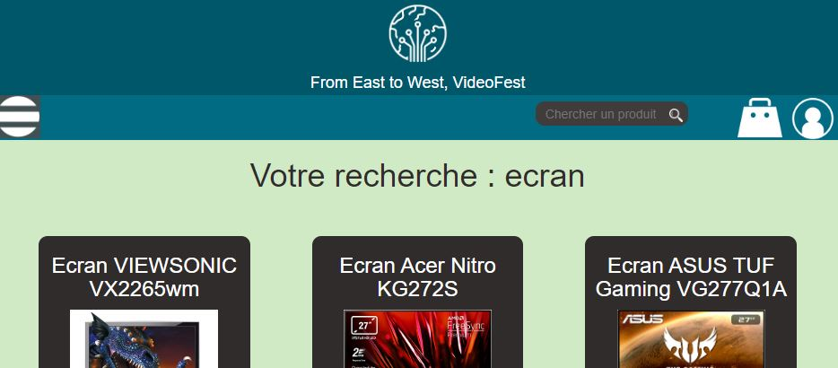

Si jamais il n'y a pas de produits correspondants, un message explicite sera affiché :

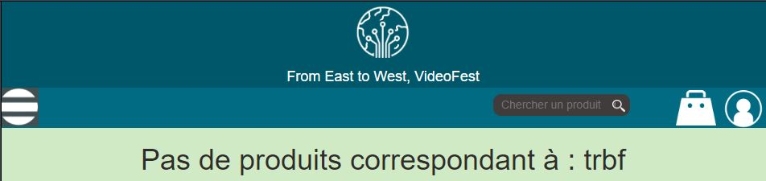

==== Visualiser un produit

Pour voir un produit, il faut d'abord avoir fait une recherche (par nom ou par catégorie), puis il faut cliquer sur le bouton "Voir plus" du produit voulu. 

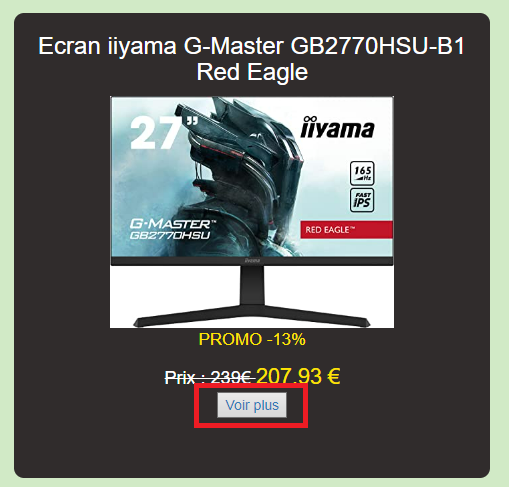

Ensuite le produit s'affiche ainsi que ses informations : 

image::images/produit.png[]

=== c) Client

==== Se connecter

Pour se connecter, il faut d'abord aller sur la page de connexion, soit par l'icone en haut à gauche du site :

Soit par le menu :

Ce qui nous amène au formulaire de connexion : 

Tous les champs doivent être remplis, un compte avec cette adresse mail doit déjà exister, et le mot de passe doit être le même que celui enregistré précédemment. Il est possible de cocher la case "Se souvenir de moi", qui permettra à l'aide d'un cookie de stocker l'adresse mail pour se reconnecter plus tard. Ensuite il faut cliquer sur "Continuer" et si jamais une erreur est faite, un message explicatif s'affichera. S'il n'y a pas d'erreur le client sera connecté et redirigé vers la

==== Se déconnecter

Pour se déconnecter, il faut d'abord être connecté et être sur la page de visualisation de compte, soit par l'icone en haut à gauche :

Soit par le menu :

Ce qui nous amène à la page de visualisation du compte, d'où il faut cliquer sur le bouton "Déconnexion" : 

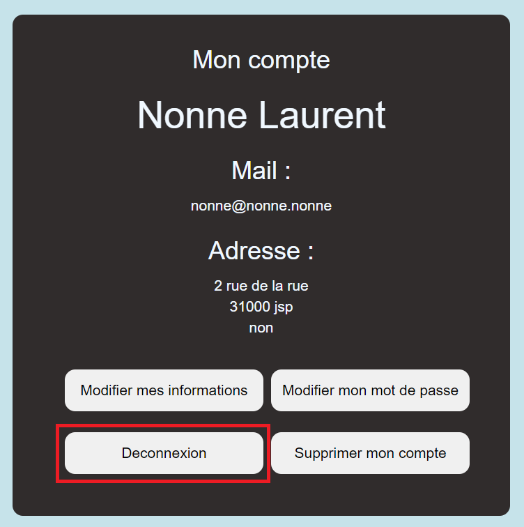

Le client est alors déconnecté et redirigé vers la page principale.

==== Voir ses informations

Pour voir ses informations de compte, il faut d'abord être connecté et ensuite aller sur la page de visualisation de compte, soit par l'icone en haut à gauche :

Soit par le menu :

Ce qui nous amène à la page de visualisation du compte : 

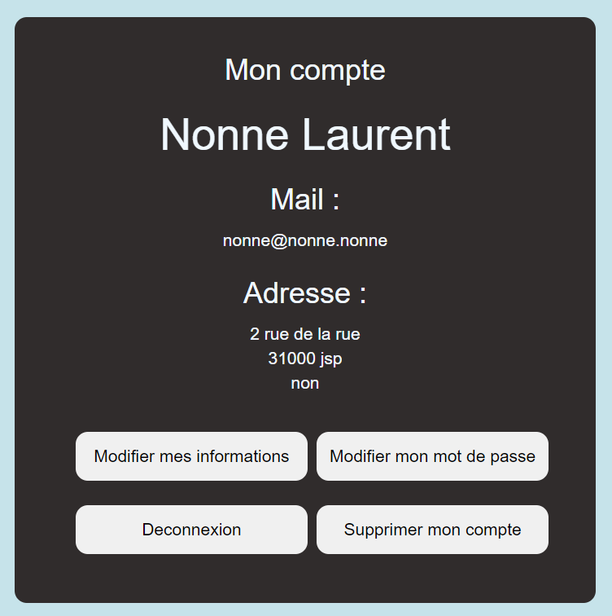

Le client peut alors visualiser ses informations.

==== Modifier ses informations

Pour modifier ses informations de compte, il faut d'abord être connecté et être sur la page de visualisation de compte, soit par l'icone en haut à gauche :

Soit par le menu :

Ce qui nous amène à la page de visualisation du compte, d'où il faut cliquer sur "Modifier mes informations" : 

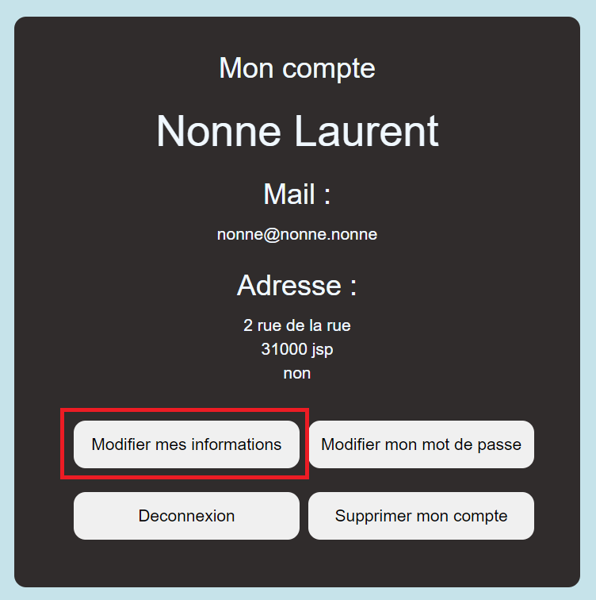

On arrive alors sur un formulaire dont les champs sont préremplis : 

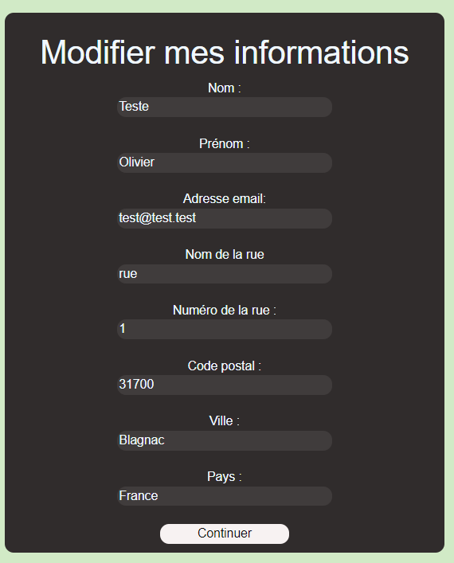

Il suffit de modifier les informations voulues, attention si l'adresse mail est modifié il se peut qu'un autre compte utilise déjà cette adresse mail, et les champs doivent être valides, l'adresse n'est pas obligatoire. Ensuite il faut cliquer sur "Continuer" et si jamais une erreur est faite, un message explicatif s'affichera. S'il n'y a pas d'erreur les informations seront mises à jour et le client sera redirigé vers la page de visualisation de son compte.

==== Modifier son mot de passe

Pour modifier son mot de passe, il faut d'abord être connecté et être sur la page de visualisation de compte, soit par l'icone en haut à gauche :

Soit par le menu :

Ce qui nous amène à la page de visualisation du compte, d'où il faut cliquer sur "Modifier mon mot de passe" : 

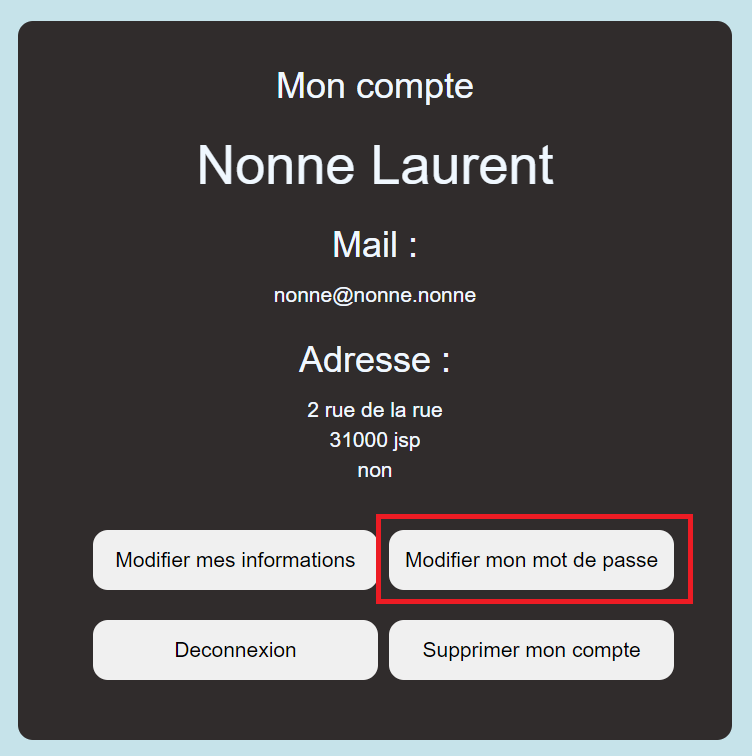

On arrive alors sur un formulaire pour faire la modification : 

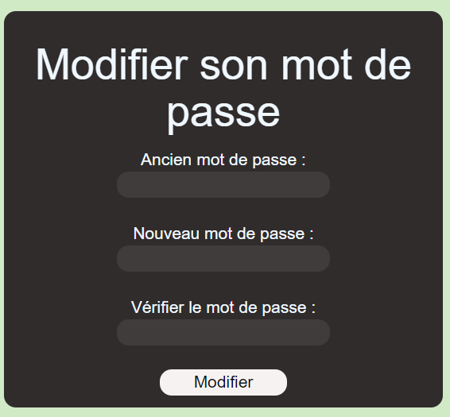

Il faut saisir l'ancien mot de passe, le nouveau et sa vérification, attention le mot de passe doit respecter les normes RGPD (https://www.donneespersonnelles.fr/generateur-de-mot-de-passe[générateur]). Ensuite il faut cliquer sur "Modifier" et si jamais une erreur est faite, un message explicatif s'affichera. S'il n'y a pas d'erreur les informations seront mises à jour et le client sera redirigé vers la page de visualisation de son compte.

==== Supprimer son compte

Pour supprimer son compte, il faut d'abord être connecté et être sur la page de visualisation de compte, soit par l'icone en haut à gauche :

Soit par le menu :

Ce qui nous amène à la page de visualisation du compte, d'où il faut cliquer sur "Supprimer mon compte" : 

image::images/boutonSupprimerCompte.png[]

Un pop-up s'affichera : 

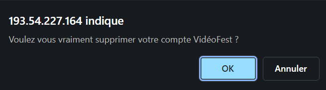

En cliquant sur "Annuler", alors la suppression ne sera pas faite, en revanche en cliquant sur "Ok", le compte et les données liées seront supprimées, le client sera déconnecté puis redirigé vers la page principale avec une popup informative :

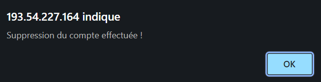

==== Mettre un article au panier

Pour mettre un article au panier, il faut d'abord avoir fait une recherche de produits, puis avoir cliqué sur le lien "Voir plus" du produit voulu. Ensuite dans la partie droite de la page, il faut sélectionner la quantité et la couleur voulue, puis cliquer sur le bouton "Ajouter au panier"; 

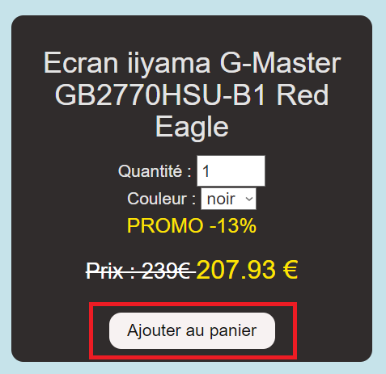

Ensuite pour visualiser le panier, il faut cliquer sur l'icone de panier en haut à droite de le page : 

image::images/boutonPanier.png[]

Puis le panier s'affiche : 

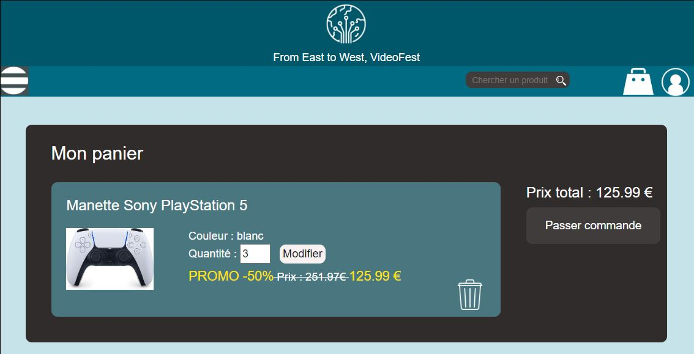

==== Modifier la quantité d'un article du panier

Il faut d'abord aller sur le panier en cliquant sur l'icone de panier : 

image::images/boutonPanier.png[]

Ensuite il faut sélectionner la quantité voulue sur un article et cliquer sur "Modifier" pour enregistrer les modifications : 

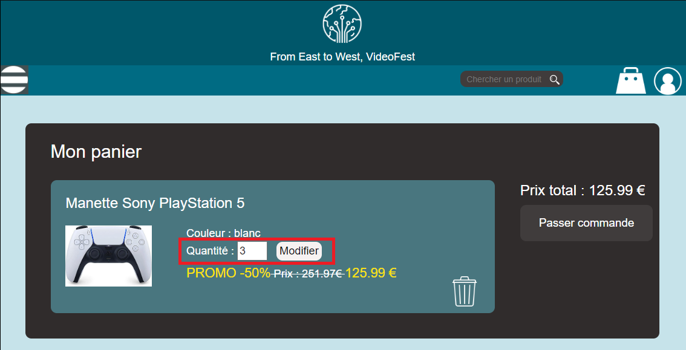

Si jamais il n'y a pas assez de stock il ne sera pas possible de modifier la quantité voulue :

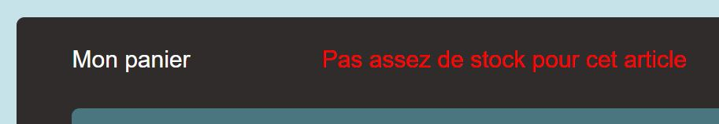

==== Supprimer un article du panier

Il faut d'abord aller sur le panier en cliquant sur l'icone de panier : 

image::images/boutonPanier.png[]

Ensuite il faut cliquer sur l'icone poubelle afin de supprimer l'article de votre panier : 

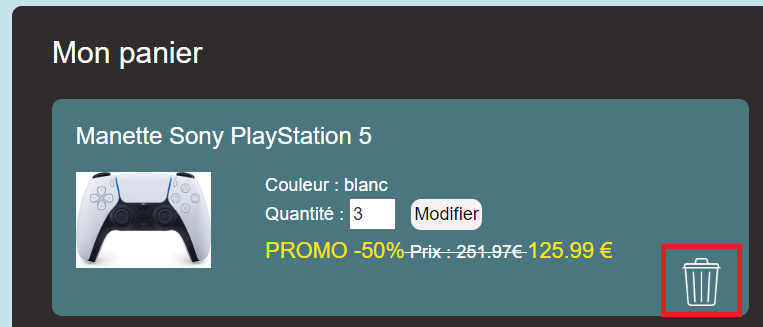

=== d) Administrateur

rien pour le moment
